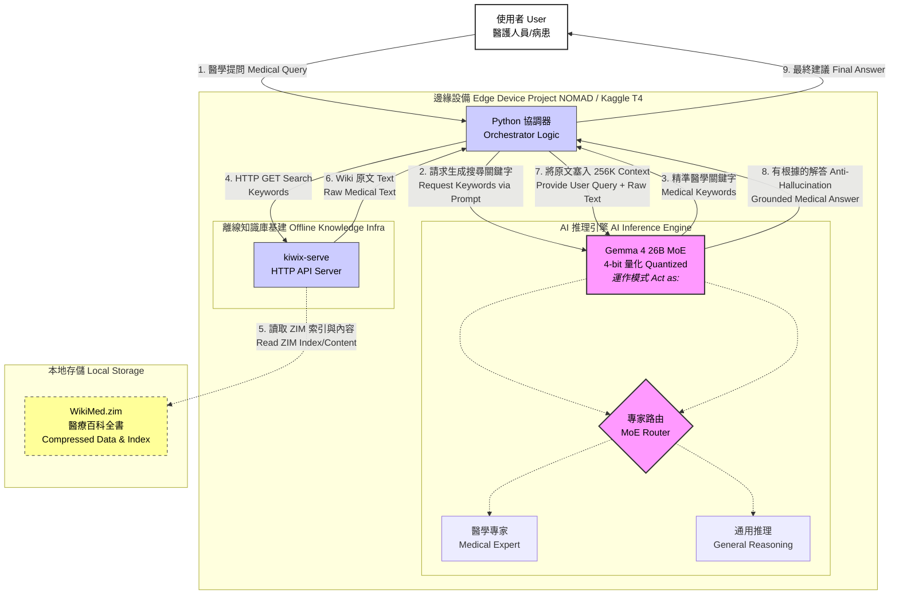

# 2026-gemma-4-hackathon
Planning Stage &amp; Code

https://www.kaggle.com/competitions/gemma-4-good-hackathon

```mermaid
graph TD
    %% Define Nodes
    User[使用者 User<br/>醫護人員/病患]
    
    subgraph "邊緣設備 Edge Device Project NOMAD / Kaggle T4"
        Orchestrator[Python 協調器<br/>Orchestrator Logic]
        
        subgraph "AI 推理引擎 AI Inference Engine"
            LLM_MoE[Gemma 4 26B MoE<br/>4-bit 量化 Quantized<br/><i>運作模式 Act as:</i>]
            Router{專家路由<br/>MoE Router}
            Expert_A[醫學專家<br/>Medical Expert]
            Expert_B[通用推理<br/>General Reasoning]
        end
        
        subgraph "離線知識庫基建 Offline Knowledge Infra"
            KiwixServe[kiwix-serve<br/>HTTP API Server]
        end
    end
    
    subgraph "本地存儲 Local Storage"
        ZIM_File[WikiMed.zim<br/>醫療百科全書<br/>Compressed Data & Index]
    end

    %% Define Interactions & Data Flow
    User -->|1. 醫學提問 Medical Query| Orchestrator
    
    %% Task 1: Query Expansion
    Orchestrator -->|2. 請求生成搜尋關鍵字<br/>Request Keywords via Prompt| LLM_MoE
    LLM_MoE -.-> Router
    Router -.-> Expert_B
    LLM_MoE -->|3. 精準醫學關鍵字<br/>Medical Keywords| Orchestrator
    
    %% Task 2: Data Retrieval
    Orchestrator -->|4. HTTP GET Search<br/>Keywords| KiwixServe
    KiwixServe -.->|5. 讀取 ZIM 索引與內容<br/>Read ZIM Index/Content| ZIM_File
    KiwixServe -->|6. Wiki 原文 Text<br/>Raw Medical Text| Orchestrator
    
    %% Task 3: Synthesis
    Orchestrator -->|7. 將原文塞入 256K Context<br/>Provide User Query + Raw Text| LLM_MoE
    LLM_MoE -.-> Router
    Router -.-> Expert_A
    LLM_MoE -->|8. 有根據的解答 Anti-Hallucination<br/>Grounded Medical Answer| Orchestrator
    
    Orchestrator -->|9. 最終建議 Final Answer| User

    %% Styling for clarity
    classDef brain fill:#f9f,stroke:#333,stroke-width:2px,color:black;
    classDef storage fill:#ff9,stroke:#333,stroke-width:1px,stroke-dasharray: 5 5,color:black;
    classDef logic fill:#ccf,stroke:#333,stroke-width:1px,color:black;
    classDef user fill:#fff,stroke:#333,stroke-width:2px,color:black;

    class LLM_MoE,Router brain;
    class ZIM_File storage;
    class Orchestrator,KiwixServe logic;
    class User user;
```