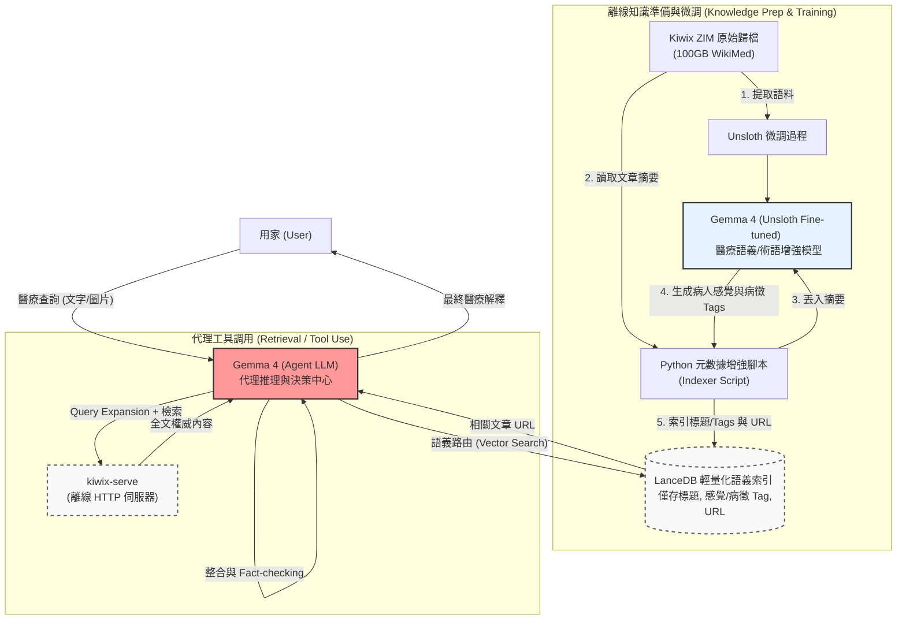
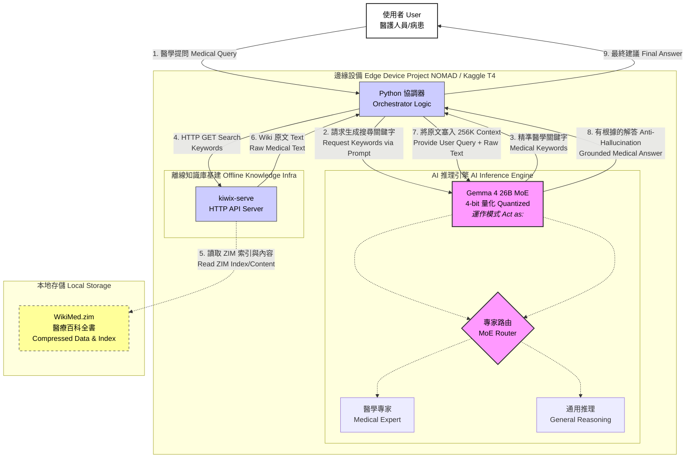

```mermaid
graph TD
    %% 定義節點 (Components)
    User["用家 (User)"]
    GemmaAgent["Gemma 4 (Agent LLM) <br/> 代理推理與決策中心"]
    GemmaUnsloth["Gemma 4 (Unsloth Fine-tuned) <br/> 醫療語義/術語增強模型"]
    KiwixZIM["Kiwix ZIM 原始歸檔 <br/> (100GB WikiMed)"]
    MetadataScript["Python 元數據增強腳本 <br/> (Indexer Script)"]
    LanceDB[("LanceDB 輕量化語義索引 <br/> 僅存標題, 感覺/病徵 Tag, URL")]
    KiwixServe["kiwix-serve <br/> (離線 HTTP 伺服器)"]

    %% 離線知識準備階段 (Offline Phase)
    subgraph "離線知識準備與微調 (Knowledge Prep & Training)"
        KiwixZIM -->|"1. 提取語料"| UnslothProcess["Unsloth 微調過程"]
        UnslothProcess --> GemmaUnsloth
        KiwixZIM -->|"2. 讀取文章摘要"| MetadataScript
        MetadataScript -->|"3. 丟入摘要"| GemmaUnsloth
        GemmaUnsloth -->|"4. 生成病人感覺與病徵 Tags"| MetadataScript
        MetadataScript -->|"5. 索引標題/Tags 與 URL"| LanceDB
    end

    %% 在線檢索與代理決策階段 (Online Phase)
    User -->|"醫療查詢 (文字/圖片)"| GemmaAgent
    GemmaAgent -->|"Agentic Reasoning / 決策"| GemmaAgent

    subgraph "代理工具調用 (Retrieval / Tool Use)"
        GemmaAgent -->|"語義路由 (Vector Search)"| LanceDB
        LanceDB -->|"相關文章 URL"| GemmaAgent
        GemmaAgent -->|"Query Expansion + 檢索"| KiwixServe
        KiwixServe -->|"全文權威內容"| GemmaAgent
    end

    GemmaAgent -->|"整合與 Fact-checking"| GemmaAgent
    GemmaAgent -->|"最終醫療解釋"| User

    %% 樣式美化
    style GemmaAgent fill:#ff9999,stroke:#333,stroke-width:2px
    style GemmaUnsloth fill:#e6f3ff,stroke:#333,stroke-width:2px
    style LanceDB fill:#f9f9f9,stroke:#666,stroke-width:2px,stroke-dasharray: 5 5
    style KiwixServe fill:#f9f9f9,stroke:#666,stroke-width:2px,stroke-dasharray: 5 5
```

```mermaid

graph TD
    %% Define Nodes
    User[使用者 User<br/>醫護人員/病患]
    
    subgraph "邊緣設備 Edge Device Project NOMAD / Kaggle T4"
        Orchestrator[Python 協調器<br/>Orchestrator Logic]
        
        subgraph "AI 推理引擎 AI Inference Engine"
            LLM_MoE[Gemma 4 26B MoE<br/>4-bit 量化 Quantized<br/><i>運作模式 Act as:</i>]
            Router{專家路由<br/>MoE Router}
            Expert_A[醫學專家<br/>Medical Expert]
            Expert_B[通用推理<br/>General Reasoning]
        end
        
        subgraph "離線知識庫基建 Offline Knowledge Infra"
            KiwixServe[kiwix-serve<br/>HTTP API Server]
        end
    end
    
    subgraph "本地存儲 Local Storage"
        ZIM_File[WikiMed.zim<br/>醫療百科全書<br/>Compressed Data & Index]
    end

    %% Define Interactions & Data Flow
    User -->|1. 醫學提問 Medical Query| Orchestrator
    
    %% Task 1: Query Expansion
    Orchestrator -->|2. 請求生成搜尋關鍵字<br/>Request Keywords via Prompt| LLM_MoE
    LLM_MoE -.-> Router
    Router -.-> Expert_B
    LLM_MoE -->|3. 精準醫學關鍵字<br/>Medical Keywords| Orchestrator
    
    %% Task 2: Data Retrieval
    Orchestrator -->|4. HTTP GET Search<br/>Keywords| KiwixServe
    KiwixServe -.->|5. 讀取 ZIM 索引與內容<br/>Read ZIM Index/Content| ZIM_File
    KiwixServe -->|6. Wiki 原文 Text<br/>Raw Medical Text| Orchestrator
    
    %% Task 3: Synthesis
    Orchestrator -->|7. 將原文塞入 256K Context<br/>Provide User Query + Raw Text| LLM_MoE
    LLM_MoE -.-> Router
    Router -.-> Expert_A
    LLM_MoE -->|8. 有根據的解答 Anti-Hallucination<br/>Grounded Medical Answer| Orchestrator
    
    Orchestrator -->|9. 最終建議 Final Answer| User

    %% Styling for clarity
    classDef brain fill:#f9f,stroke:#333,stroke-width:2px,color:black;
    classDef storage fill:#ff9,stroke:#333,stroke-width:1px,stroke-dasharray: 5 5,color:black;
    classDef logic fill:#ccf,stroke:#333,stroke-width:1px,color:black;
    classDef user fill:#fff,stroke:#333,stroke-width:2px,color:black;

    class LLM_MoE,Router brain;
    class ZIM_File storage;
    class Orchestrator,KiwixServe logic;
    class User user;
```